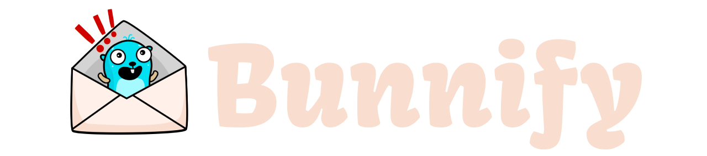

<p align="center">
    
</p>

<div align="center">

[](https://goreportcard.com/report/github.com/pmorelli92/bunnify)
[](LICENSE)
[](https://github.com/pmorelli92/bunnify/actions/workflows/main.yaml)
[](https://coveralls.io/github/pmorelli92/bunnify?branch=main)

Bunnify is a library for publishing and consuming events for AMQP.

</div>

## Features

**Easy setup:** Bunnify is designed to be easy to set up and use. Simply reference the library and start publishing and consuming events.

**Automatic payload marshaling and unmarshaling:** You can consume the same payload you published, without worrying about the details of marshaling and unmarshaling. Bunnify handles these actions for you, abstracting them away from the developer.

**Automatic reconnection:** If your connection to the AMQP server is interrupted, Bunnify will automatically handle the reconnection for you. This ensures that your events are published and consumed without interruption.

**Built-in event metadata handling:** The library automatically handles event metadata, including correlation IDs and other important details.

**Minimal dependencies:** Bunnify is built on top of `github.com/rabbitmq/amqp091-go`, which means that it doesn't add any unnecessary dependencies to your project.

## Motivation

Every workplace I have been had their own AMQP library. Most of the time the problems that they try to solve are reconnection, logging, correlation, handling the correct body type for events and dead letter. Most of this libraries are good but also built upon some other internal libraries and with some company's specifics that makes them impossible to open source.

Some developers are often spoiled with these as they provide a good dev experience and that is great; but you cannot use it in side projects, or if you start your own company.

Bunnify aims to provide a flexible and adaptable solution that can be used in a variety of environments and scenarios. By abstracting away many of the technical details of AMQP publishing and consumption, Bunnify makes it easy to get started with event-driven architecture without needing to be an AMQP expert.

## Experimental

Important Note: Bunnify is currently in an early stage of development. This means that the API may change substantially in the coming weeks.

I encourage you to test Bunnify thoroughly in a development or staging environment before using it in a real work environment. This will allow you to become familiar with its features and limitations, and help me identify any issues that may arise.

## Example

You can find working examples under the `tests` folder.

### Consumer

```go
package main
import (
	"context"
	"encoding/json"
	"fmt"
	"log"
	"sync"
	"time"

	"github.com/pmorelli92/bunnify/bunnify"
)

func main() {
	connection := bunnify.NewConnection()
	connection.Start()

	consumer, err := connection.NewConsumer(
		"queue1",
		bunnify.WithBindingToExchange("exchange1"),
		bunnify.WithHandler("catCreated", HandleCatCreated),
		bunnify.WithHandler("personCreated", HandlePersonCreated),
		bunnify.WithDeadLetterQueue("dead-queue"))
	if err != nil {
		log.Fatal(err)
	}
	consumer.Consume()

	deadLetterConsumer, err := connection.NewConsumer(
		"dead-queue",
		bunnify.WithDefaultHandler(HandleDefault))
	if err != nil {
		log.Fatal(err)
	}
	deadLetterConsumer.Consume()

	wg := sync.WaitGroup{}
	wg.Add(1)
	wg.Wait()
}

func HandleDefault(ctx context.Context, event bunnify.ConsumableEvent[json.RawMessage]) error {
	return nil
}

type personCreated struct {
	Name string `json:"name"`
}

func HandlePersonCreated(ctx context.Context, event bunnify.ConsumableEvent[personCreated]) error {
	fmt.Println("Event ID: " + event.ID)
	fmt.Println("Correlation ID: " + event.CorrelationID)
	fmt.Println("Timestamp: " + event.Timestamp.Format(time.DateTime))
	fmt.Println("Person created with name: " + event.Payload.Name)
	return nil
}

type catCreated struct {
	Years int `json:"years"`
}

func HandleCatCreated(ctx context.Context, event bunnify.ConsumableEvent[catCreated]) error {
	fmt.Println("Event ID: " + event.ID)
	fmt.Println("Correlation ID: " + event.CorrelationID)
	fmt.Println("Timestamp: " + event.Timestamp.Format(time.DateTime))
	fmt.Println("Cat created with years: " + fmt.Sprint(event.Payload.Years))
	return nil
}
```

### Publisher

```go
package main

import (
	"context"
	"fmt"
	"time"

	"github.com/pmorelli92/bunnify/bunnify"
)

func main() {
	c := bunnify.NewConnection()
	c.Start()

	publisher := c.NewPublisher()

	event := bunnify.PublishableEvent{
		Metadata: bunnify.Metadata{
			ID:            "12345",
			CorrelationID: "6789",
			Timestamp:     time.Now(),
		},
		Payload: catCreated{
			Years: 22,
		},
	}

	if err := publisher.Publish(context.TODO(), "exchange1", "catCreated", event); err != nil {
		fmt.Println(err)
	}
}

type catCreated struct {
	Years int `json:"years"`
}
```
